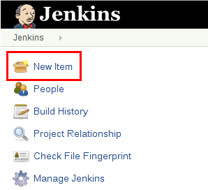

# 创建第一个Pipeline
要快速入门Pipeline：
1. 将下面的示例复制到您的存储库中并将其命名为Jenkinsfile
1. 点击Jenkins中的New Item菜单

1. 为您的新项目（例如我的Piperline）提供名称，然后选择多分支Piperline
1. 单击添加源按钮，选择要使用的存储库的类型并填写详细信息。
1. 点击保存按钮并观看您的第一条管道运行！

您可能需要修改一个Jenkinsfile示例以使其与您的项目一起运行。 尝试修改sh命令以运行您在本地计算机上运行的相同命令。
设置流水线后，Jenkins将自动检测在存储库中创建的任何新的分支或Pull请求，并为其启动运行管道。

## 快速开始例子:
### java
```java
Jenkinsfile (Declarative Pipeline)
pipeline {
    agent { docker 'maven:3.3.3' }
    stages {
        stage('build') {
            steps {
                sh 'mvn --version'
            }
        }
    }
}
```
### Node.js /Javascript
```js
Jenkinsfile (Declarative Pipeline)
pipeline {
    agent { docker 'node:6.3' }
    stages {
        stage('build') {
            steps {
                sh 'npm --version'
            }
        }
    }
}
```
### Ruby
```ruby
Jenkinsfile (Declarative Pipeline)
pipeline {
    agent { docker 'ruby' }
    stages {
        stage('build') {
            steps {
                sh 'ruby --version'
            }
        }
    }
}
```
### Python
```python
Jenkinsfile (Declarative Pipeline)
pipeline {
    agent { docker 'python:3.5.1' }
    stages {
        stage('build') {
            steps {
                sh 'python --version'
            }
        }
    }
}
```

### php
```php
Jenkinsfile (Declarative Pipeline)
pipeline {
    agent { docker 'php' }
    stages {
        stage('build') {
            steps {
                sh 'php --version'
            }
        }
    }
}
```