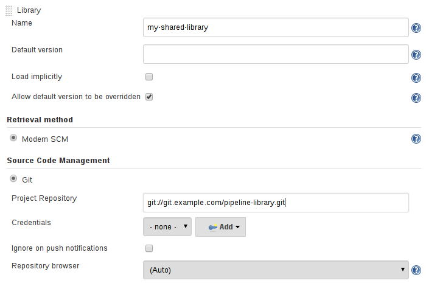

# G使用共享库进行扩展

随着组织中越来越多的项目采用Pipeline,可能会出现通用的模式.通常,再各个项目之间共享部分pipeline以减少冗余是非常有用的.

Pipeline支持创建"Shared Libraries",可以讲外部Lib库定义并加载到现有pipeline中.

## 定义共享库

共享库定义有name，源代码检索方法（如SCM）和可选的默认version。 该name应该是一个简短的标识符，因为它将在脚本中使用。

version可以是SCM理解的任何内容;例如,branches,tags,和commit hashes都适用于GIT。你还可以生命脚本是否需要显示请求该库.或者默认情况下是否存在.此外如果在jenkins配置中指定version,则可以阻止脚本选择其他version.

指定SCM的最佳方式是使用SCM插件.该插件已住啊们更新,以支持用于checkout任意name version的新API（Moder SCM选项）.

如果你的SCM插件尚未集成,你可以选择Legacy SCM并选择其所提供的任何内容.在这种情况下,你需要在SCM的配置中包含${library.yourLibName.version},以便在checkout时插件将扩展此变量以选择所需的version.例如,对于Subversion,你可以将库存URL设置为svnserver/project/\${library.yourLibName.version}.然后使用trunk或branches/dev或tags/1.0等版本

### 目录结构

共享库存储库的目录结构如下：

```xml
(root)
+- src                     # Groovy 源码文件
|   +- org
|       +- foo
|           +- Bar.groovy  # for org.foo.Bar class
+- vars
|   +- foo.groovy          #  全局'foo'变量
|   +- foo.txt             # 'foo' 变量的帮助文档
+- resources               # 资源文件 (external libraries only)
|   +- org
|       +- foo
|           +- bar.json    # static helper data for org.foo.Bar
```

src目录应该看起来像标准的Java源目录结构。 执行pipeline时，此目录将添加到classpath中。

vars目录托管定义可从Pipeline访问的全局变量的脚本。 每个.groovy文件的基名应该是一个Groovy（~Java）标识符，通常是驼峰格式。 匹配的.txt（如果存在）可以包含文档，通过系统配置的标记格式化程序处理（因此可能最终的是HTML，Markdown等，尽管需要txt扩展名）

这些目录中的Groovy源文件与Scripted Pipeline中的“CPS转换”相同。

resources目录允许从外部库使用libraryResource步骤来加载关联的非Groovy文件。 目前，内部库不支持此功能。

root目录下的其他目录保留用于将来的增强。

## 全局共享Libraries

根据用例，有几个地方可以定义共享库。 manager Jenkins»系统配置(configure System)»*Global Pipeline Libraries*可以根据需要配置多个库。

由于这些库可以全局使用，因此系统中的任何管道都可以利用这些库中实现的功能。

这些库被认为是“可信的：”它们可以运行Java，Groovy，Jenkins内部API，Jenkins插件或第三方库中的任何方法。 这允许您定义库，这些库将单独的不安全API封装在更高级别的包装器中，以便从任何管道中使用。 请注意，任何能够将提交推送到此SCM存储库的人都可以无限制地访问Jenkins。 您需要使用Overall/RunScripts权限来配置这些库（通常这将需要授予Jenkins管理员权限）。

### 文件夹(Folder-level)级别的共享库

创建的任何文件夹都可以具有与之关联的共享库.此机制允许将特定库的范围限定为文件夹或子文件夹内的所有pipeline.

基于文件夹的苦不被视为"可信的",它们在Groovy沙箱中运行。就像典型的pipine一样。

### 自动共享库

其他插件可能会添加动态定义库的方法.例如,[Github Branch Source](https://plugins.jenkins.io/github-branch-source)插件可以提供一个"GitHub Organization Folder"项,该选项允许脚本使用不受信任的库,例如github.com/someorg/somerepo，无需任何其他配置。 在这种情况下，将使用匿名checkout从master分支加载指定的GitHub存储库。

## 使用库

标记为Load的共享库隐式允许Pipelines立即使用由任何此类库定义的类或全局变量。 要访问其他共享库，Jenkinsfile需要使用@Library注释，指定库的名称：


```groovy
@Library('my-shared-library') _
/* Using a version specifier, such as branch, tag, etc */
@Library('my-shared-library@1.0') _
/* Accessing multiple libraries with one statement */
@Library(['my-shared-library', 'otherlib@abc1234']) _
```

注解可以是脚本中Groovy允许注解的任何位置。 当引用类库（带有src/ 目录）时，通常注解会在import语句中进行：

```groovy
@Library('somelib')
import com.mycorp.pipeline.somelib.UsefulClass
```

对于仅定义全局变量（vars /）的共享库或仅需要全局变量的Jenkinsfile，注解模式@Library（'my-shared-library')_可能对于保持代码简洁有用。 本质上，注解是import的不必要代替,符号\_可以表示为注解。

不建议导入全局变量/函数，因为这会强制编译器将字段和方法解析为static的，即使它们是作为实例的。 在这种情况下，Groovy编译器可能会产生令人困惑的错误消息。

```groovy
@Library('somelib')
import com.mycorp.pipeline.somelib.Helper

int useSomeLib(Helper helper) {
    helper.prepare()
    return helper.count()
}

echo useSomeLib(new Helper('some text'))
```

但是，全局变量在运行时得到解析

## 动态加载库

在Pipeline：Shared Groovy Libraries插件的2.7版本中，有一个用于在脚本中加载（非隐式）库的新选项：在构建期间的任何时候动态加载库的libray step。

如果您只想使用全局变量/函数（来自vars/ 目录），则语法非常简单：

```groovy
library 'my-shared-library'
```

此后，脚本可以访问该库中的任何全局变量。

使用src/目录中的类也是可能的，但更棘手。 @Library注解在编译之前准备脚本的“classpath”，而在遇到libray step时，脚本已经被编译。 因此，您无法导入或“静态地”引用库中的类型。

但是，您可以动态使用库class（不进行类型检查），从libray step的返回值通过完全限定名访问它们。 可以使用类似Java的语法调用静态方法：

```groovy
library('my-shared-library').com.mycorp.pipeline.Utils.someStaticMethod()
```

您还可以访问静态字段，并调用构造函数，就好像它们是名为new的静态方法一样：

```groovy
def useSomeLib(helper) { // dynamic: cannot declare as Helper
    helper.prepare()
    return helper.count()
}

def lib = library('my-shared-library').com.mycorp.pipeline // preselect the package

echo useSomeLib(lib.Helper.new(lib.Constants.SOME_TEXT))
```

## 库版本

当选中"Load implicitly"或如果pipeline仅按name引用库,例如@Library('my-shared-library')_ ,则使用已配置共享库的"default version"。如果未定义"default version",则pipeline必须指定version,例如@Library('my-shared-library@master')_.

如果在共享库的配置中启用了"Allow default version to be overridden(允许覆盖默认版本)",则@Library注解也可能会覆盖为库定义的default version.如果需要,还允许从不同版本加载具有"隐式加载"的库。

使用libray step时，您还可以指定版本：

```groovy
library 'my-shared-library@master'
```

由于这是一个常规步骤，因此可以计算该版本而不是与注解一样的常量; 例如：

````groovy
library "my-shared-library@$BRANCH_NAME"
````

将使用与多分支jenkinsfile相同的SCM分支加载库。您可以通过参数选择一个库：

```groovy
properties([parameters([string(name: 'LIB_VERSION', defaultValue: 'master')])])
library "my-shared-library@${params.LIB_VERSION}"
```

请注意，libray可能不会用于覆盖隐式加载库的版本。 它已在脚本启动时加载，并且给定名称的库可能不会加载两次。

## 检索方法

指定SCM的最佳方法是使用SCM插件，该插件已经过专门更新，以支持用于checkout任意命名版本的新API（Modern SCM选项）。 在撰写本文时，最新版本的Git和Subversion插件支持此模式。



### Legacy SCM

尚未更新以支持共享库所需的较新功能的SCM插件仍可通过Legacy SCM选项使用。 在这种情况下${library.yourlibrarynamehere.version}，只要为该特定SCM插件配置branch/tag/ref。 这确保了在检查库的源代码时，SCM插件将扩展此变量以checkout库的适当版本。


### 动态检索

如果您只在libary step中指定库名称（可选择使用@之后的版本），Jenkins将查找该名称的预配置库。 （或者在github.com/owner/repo自动库的情况下，它会加载它。）

但是您也可以动态指定检索方法，在这种情况下，不需要在Jenkins中预定义库。 这是一个例子:

```groovy
library identifier: 'custom-lib@master', retriever: modernSCM(
  [$class: 'GitSCMSource',
   remote: 'git@git.mycorp.com:my-jenkins-utils.git',
   credentialsId: 'my-private-key'])
```

最好参考Pipeline语法以获取SCM的精确语法。

请注意，在这些情况下必须指定库版本。

## 编写库

在基础级别，任何有效的[Groovy代码](http://groovy-lang.org/syntax.html)都可以使用。 不同的数据结构，实用方法等，例如：

```groovy
// src/org/foo/Point.groovy
package org.foo;

// point in 3D space
class Point {
  float x,y,z;
}
```

### 访问step

库类不能直接调用sh或git等步骤。 但是，它们可以在封闭类的范围之外实现方法，而后者又调用Pipeline步骤，例如：

```groovy
// src/org/foo/Zot.groovy
package org.foo;

def checkOutFrom(repo) {
  git url: "git@github.com:jenkinsci/${repo}"
}

return this
```

然后可以从Scripted Pipeline中调用它：

```groovy
def z = new org.foo.Zot()
z.checkOutFrom(repo)
```

这种方法有局限性; 例如，它阻止了超类的声明。

或者，可以使用此方法将一组步骤显式传递给库类，构造函数或只有一个方法：

```groovy
package org.foo
class Utilities implements Serializable {
  def steps
  Utilities(steps) {this.steps = steps}
  def mvn(args) {
    steps.sh "${steps.tool 'Maven'}/bin/mvn -o ${args}"
  }
}
```

在类（例如上面）上保存状态时，该类必须实现Serializable接口。 这可以确保使用该类的Pipeline（如下例所示）可以在Jenkins中正确挂起和恢复。

```groovy
@Library('utils') import org.foo.Utilities
def utils = new Utilities(this)
node {
  utils.mvn 'clean package'
}
```

如果库需要访问全局变量（例如env），则应以类似的方式将这些变量显式地传递到库类或方法中。

而不是将多个变量从Scripted Pipeline传递到库中，

```groovy
package org.foo
class Utilities {
  static def mvn(script, args) {
    script.sh "${script.tool 'Maven'}/bin/mvn -s ${script.env.HOME}/jenkins.xml -o ${args}"
  }
}
```

上面的示例显示了脚本被传递给一个静态方法，从Scripted Pipeline调用，如下所示：

```groovy
@Library('utils') import static org.foo.Utilities.*
node {
  mvn this, 'clean package'
}
```

## 定义全局变量

在内部，vars目录中的脚本按需实例化为单例。 为方便起见，这允许在单个.groovy文件中定义多个方法。 例如：

```groovy
vars/log.groovy
def info(message) {
    echo "INFO: ${message}"
}

def warning(message) {
    echo "WARNING: ${message}"
}
```

```jenkinsfile
Jenkinsfile
@Library('utils') _

log.info 'Starting'
log.warning 'Nothing to do!'
```

声明性管道不允许在脚本指令（[JENKINS-42360](https://issues.jenkins-ci.org/browse/JENKINS-42360)）之外使用全局变量。

```groovy
Jenkinsfile
@Library('utils') _

pipeline {
    agent none
    stage ('Example') {
        steps {
             script { 1
                 log.info 'Starting'
                 log.warning 'Nothing to do!'
             }
        }
    }
}
```

1： 在声明式Pipeline中访问全局变量所需的脚本指令。

> 在Jenkins加载并使用该库作为成功的管道运行的一部分之后，共享库中定义的变量将仅显示在全局变量参考（在pipeline语法下）中。
>
> 避免在全局变量中保留状态
> 避免使用交互或保留状态的方法定义全局变量。 使用静态类或实例化类的局部变量。

### 自定义step

共享库还可以定义全局变量，其行为类似于内置步骤，例如sh或git。 共享库中定义的全局变量必须以所有小写或“驼峰风格”命名，以便通过Pipeline正确加载。[2]

例如，要定义sayHello，应创建文件vars/sayHello.groovy并应实现call方法。 call方法允许以类似于步骤的方式调用全局变量：

```groovy
// vars/sayHello.groovy
def call(String name = 'human') {
    // Any valid steps can be called from this code, just like in other
    // Scripted Pipeline
    echo "Hello, ${name}."
}
```

然后，pipeline将能够引用和调用此变量：

```groovy
sayHello 'Joe'
sayHello() /* invoke with default arguments */
```

如果使用块调用，则call方法将接收Closure。 应明确定义类型以阐明该步骤的意图，例如：

```groovy
// vars/windows.groovy
def call(Closure body) {
    node('windows') {
        body()
    }
}
```

然后，Pipeline可以像接受块的任何内置步骤一样使用此变量：

```groovy
windows {
    bat "cmd /?"
}
```

### 定义更结构化的DSL

如果您有许多大致类似的pipeline，全局变量机制提供了一个方便的工具来构建捕获相似性的更高级别的DSL。 例如，所有Jenkins插件都以相同的方式构建和测试，因此我们可以编写一个名为buildPlugin的步骤：

```groovy
// vars/buildPlugin.groovy
def call(Map config) {
    node {
        git url: "https://github.com/jenkinsci/${config.name}-plugin.git"
        sh 'mvn install'
        mail to: '...', subject: "${config.name} plugin build", body: '...'
    }
}
```

假设脚本已作为全局共享库或文件夹级共享库加载，生成的Jenkinsfile将变得非常简单：

```groovy
Jenkinsfile (Scripted Pipeline)
buildPlugin name: 'git'
```

使用Groovy的Closure.DELEGATE_FIRST还有一个“构建器模式”技巧，它允许Jenkinsfile看起来更像配置文件而不是程序，但这更复杂且容易出错，因此不推荐使用。

## 使用第三方库

可以使用@Grab注解从受信任的库代码中使用通常在Maven Central中找到的第三方Java库。 有关详细信息，请参阅Grape文档，例如：

```groovy
@Grab('org.apache.commons:commons-math3:3.4.1')
import org.apache.commons.math3.primes.Primes
void parallelize(int count) {
  if (!Primes.isPrime(count)) {
    error "${count} was not prime"
  }
  // …
}
```

默认情况下，第三方库在Jenkins主服务器的〜/.groovy/grapes/中缓存。

## 加载resource

外部库可以使用libraryResource步骤从resources/目录加载附属文件。 参数是一个相对路径名，类似于Java资源加载：

```groovy
def request = libraryResource 'com/mycorp/pipeline/somelib/request.json'
```

该文件作为字符串加载，适合传递给某些API或使用writeFile保存到工作区。

建议使用独特的包结构，以免意外与其他库冲突。

## 预测试库更改

如果您发现使用不受信任的库在构建中出现错误，只需单击“Replay”链接以尝试编辑其一个或多个源文件，并查看生成的构建是否按预期运行。 对结果感到满意后，请从构建的状态页面中按照diff链接，将diff应用到库存储库并提交。

（即使为库请求的版本是分支，而不是像标记这样的固定版本，重放版本将使用与原始版本完全相同的版本：库源不会再次签出。）

目前，受信任的库不支持replay。 重播期间也不支持修改资源文件。

## 定义声明式pipeline

从2017年9月下旬发布的Declarative 1.2开始，您也可以在共享库中定义Declarative Pipelines。 这是一个示例，它将执行不同的声明性管道，具体取决于构建号是奇数还是偶数：

```groovy
// vars/evenOrOdd.groovy
def call(int buildNumber) {
  if (buildNumber % 2 == 0) {
    pipeline {
      agent any
      stages {
        stage('Even Stage') {
          steps {
            echo "The build number is even"
          }
        }
      }
    }
  } else {
    pipeline {
      agent any
      stages {
        stage('Odd Stage') {
          steps {
            echo "The build number is odd"
          }
        }
      }
    }
  }
}
```

```groovy
// Jenkinsfile
@Library('my-shared-library') _

evenOrOdd(currentBuild.getNumber())
```

到目前为止，只能在共享库中定义整个管道。 这只能在`vars/*.groovy中完成，并且只能在调用方法中完成。 在一个构建中只能执行一个Declarative Pipeline，如果您尝试执行第二个，您的构建将因此失败。